# How to run things on L40 nodes.
 This document explains how to run NVIDIA Isaac ROS packages on Palmetto Cluster. At the moment (April 2024) this document was written, the best way to go about this is to be on Windows machine with MobaXterm. The process to install MobaXterm and how to SSH into Palmetto Cluster can be [here.](https://docs.rcd.clemson.edu/palmetto/connect/ssh/). It is expected that you are either using eduroam or connected to the clemson network via VPN.


## Prerequisites
To run Nvidia Isaac ROS packages on L40 in a custom Isaac Sim environment, you need to-

    1. Setup a token to access Clemson's Nucleus server
    2. Create a workspace for Isaac ROS packages in "Omnidev" directory

### Setting up Omnitoken
To setup the token to Clemson University's Nucleus server, follow [this](https://clemson.sharepoint.com/:v:/r/teams/MATHWORKSAUTONOMY/Shared%20Documents/Husky%20ISAAC%20Collaboration/Harshal_imgs_vids/L40/Nucleus_token.mp4?csf=1&web=1&e=7VFNOr) video by James Burton. To get to the screen seen at the beginning of the video, visit the [link](https://ovxnucleus.rcd.clemson.edu/omni/web3/). 

### Setting up Omnidev
The vnodoes (virtual nodes) already have the `omnidev` drive mapped. However, this drive needs to be mapped manually on a local workstation. Manual mapping is needed for easier file transfer. Omnidev is a volume where all the environments, robot URDF's and Reinforcement Learning libraries will be. To map this drive locally follow instructions given here for [linux](https://docs.rcd.clemson.edu/indigo/access_smb/instructions_linux/) or here for [windows](https://docs.rcd.clemson.edu/indigo/access_smb/instructions_windows/).

### Download Nvidia Omniverse Launcher
You will need NVIDIA Streaming Client which needs to be downloaded using NVIDIA Omniverse Client. Follow this [Link](https://www.nvidia.com/en-us/omniverse/download/) to download NVIDIA Omniverse SDK. You will be greeted with following screen.

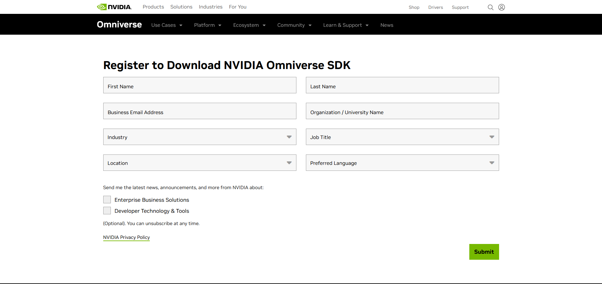

Fill out the form and click submit. On the next screen, choose the operating system. If you are following this document, you should be on windows machine.

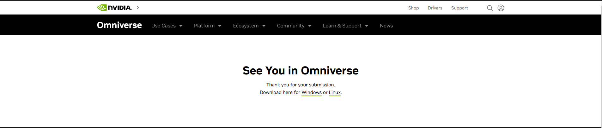

Once the download is complete, click on the executable file to install the application. After Successful installation, you should see application Icon on your Desktop.

<p align="center">
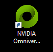
</p>

Launch the application and sign with you nvidia account. After sign in, you will see a screen similar to shown below.

<p align="center">
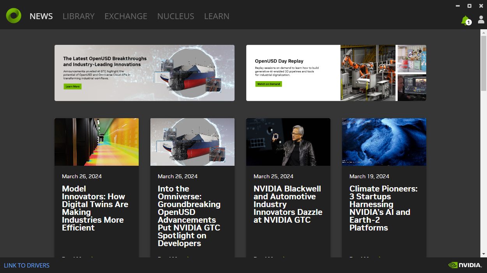
</p>

Click on `Exchange` tab and type `Streaming Client` in search bar. Click on the Streaming Client and then click install. Once installed navigate to Library tab. You should all the installed applications including Streaming Client. Click on Launch.
<p align="center">

</p>

<p align="center">
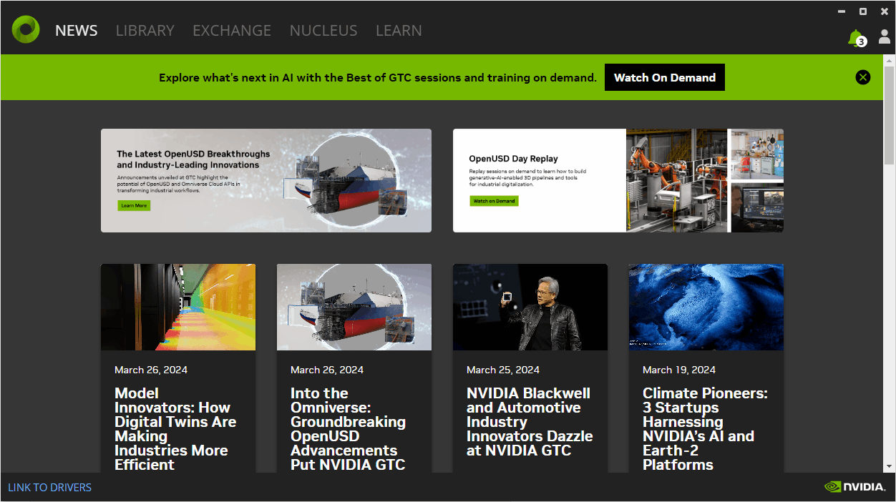
</p>


## Running Isaac ROS and Isaac Sim on L40
Once you have successfully setup omnitoken, uploaded required files in omnidev folder, and downloaded the Streaming Client you are in position run Isaac ROS and Isaac Sim on Palmetto Cluster with L40 GPU's.

### Login to Palmetto Node
First login to the Palmetto Cluster. (Note: You may not have access to the palmetto cluster by default. Please talk to your Supervisor/PI/Professor about getting the access.)
Open MobaXterm and click on `Session` tab on the upper left corner. Then Click on `SSH`. Now type the following in the `Remote Host field` keeping everything else untouched and click OK. Here replace user with Clemson user ID. You will be prompted to enter your password. This password is the same one that you use to login into CANVAS/iRoar/HR portal etc. Then choose the dual authentication method of your choice: SMS passcode or Duo Push. After successful login, you should see `Welcome to the PALMETTO CLUSTER at CLEMSON UNIVERSITY` message in the terminal window.

                                                    `USER@login.palmetto.clemson.edu`
<p align="center">

</p>

### Login to Virtual Node
In the terminal, type: `ssh -Y vnode00X` where X goes from 1 to 7. Each number represents a different virtual node on Palmetto Cluster. Pick a number and stick with it throughout this documentation. This will log you on a virtual node, where we will be doing rest of the work.
<p align="center">
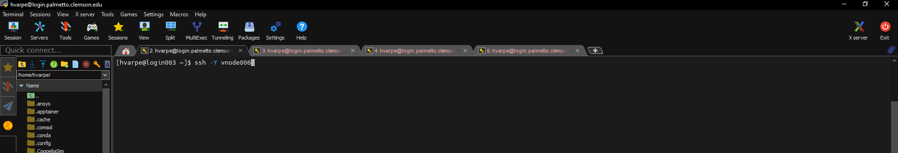
</p>

We will need four different terminals each one logged into Palmetto and same vnode. As shown below, Right click on the current terminal tab and click on duplicate. Then follow the login procedure all over again 3 times.

<p align="center">
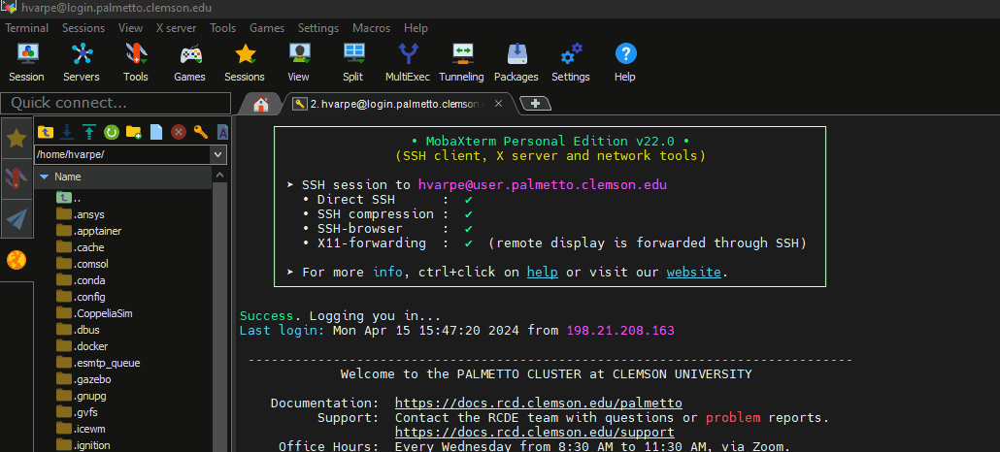
</p>

### Load Omniverse assets from Clemson's nucleus server and Launch Isaac Sim
Assuming you have successfully managed to setup omnitoken, type the following command in the first terminal:- `source .omnitoken`  
Then to make sure you have successfully source the token, type - `env | grep OMNI`. This will show you the key/token.

<p align="center">
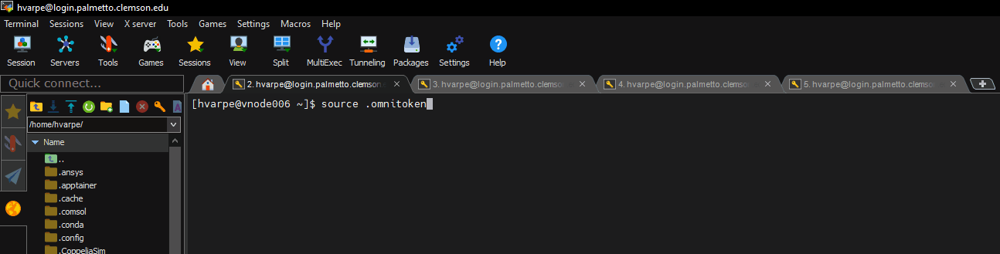
</p>

You should see the outputs shown in the gif above. If you are successful, type the following in terminal- `launch-isaac-sim`   
This command will spin up a container and launch Nvidia Isaac Sim.

<p align="center">
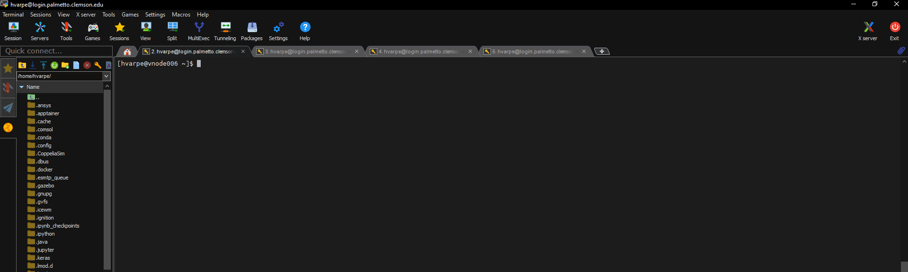
</p>

### Connect to Streaming Client
Once the isaac sim is ready and launched, you will see the message: `Isaac Sim Headless Native App is loaded` at the end of the terminal. When you see this message open up the Omniverse Launcher and start Streaming Client. If its already running, switch to that window.

The IP address of vnode is in the format of- `10.125.61.1X`, where X is the number of node raging from 1 to 7. For example, if you are on vnode006, then the IP address of that node is `10.125.61.16`. Replaced the X with 6.

In the `Server` field, type in the IP address of your vnode. Click on connect.
<p align="center">
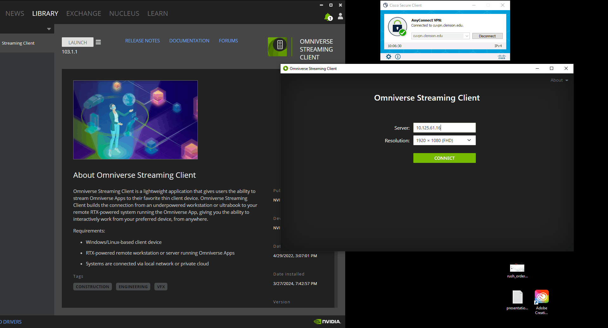
</p>

### (Optional) Add Nucleus Server
If you have successfully followed this document til here, you can either skip to next section or follow this section. At this point, you have access to the local asset of the Clemson University's nucleus server. Should you follow this section, you will be using assets that are stored onto the AWS server from NVIDIA's side. If you are planning to make custom test environment with up-to-date assets, then follow this section.

At this point, you should be able to see the loaded Nvidia Isaac Sim in your streaming client. As shown below, Click on the `Add New Connection` option shown in the bottom left corner of the Isaac Sim. A window will pop-up. In the `Omniverse://` field, type - `ovxnucleus.rcd.clemson.edu:443`.

<p align="center">
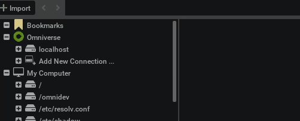
</p>

### Load the environment

### Download Isaac ROS packages and build the workspace

Now out of the four terminals we created earlier, one will have a instance of Isaac Sim running.

Switch to second terminal and check if the Isaac ROS workspace is setup. (Note, all four terminals should be logged in on vnode you are working on.)
TO check that, type in the terminal, `echo $ISAAC_ROS_WS`. You should see the output like this - `/omnidev/<YOUR_FOLDER>/workspaces/isaac_ros-dev`

<p align="center">
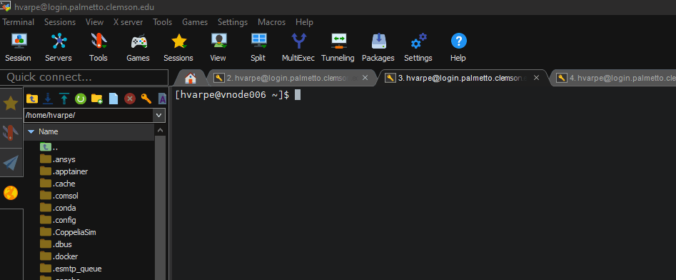
</p>

If you do not see output shown in the gif below, then you may have to set it up. Type following commands to set it up:
for more information on the following command, visit [here](https://nvidia-isaac-ros.github.io/getting_started/dev_env_setup.html).

`mkdir -p  /omnidev/<YOUR_FOLDER>/workspaces/isaac_ros-dev/src`

`echo "export ISAAC_ROS_WS=${HOME}/workspaces/isaac_ros-dev/" >> ~/.bashrc`

`source ~/.bashrc`

Now check again to see, if the environment variable ISAAC_ROS_WS is set up.
`echo $ISAAC_ROS_WS`

Once the environment is setup, type in the following commands one by one in sequential manner.

1) `cd ${ISAAC_ROS_WS}/src`
    
2) `git clone https://github.com/NVIDIA-ISAAC-ROS/isaac_ros_common.git`
    
3) `git clone https://github.com/NVIDIA-ISAAC-ROS/isaac_ros_freespace_segmentation.git`
    
4) `git clone https://github.com/NVIDIA-ISAAC-ROS/isaac_ros_depth_segmentation.git`
    
5) ` cd ${ISAAC_ROS_WS}/src/isaac_ros_depth_segmentation && git lfs pull -X "" -I "resources/rosbags/bi3dnode_rosbag" `

6) `cd ${ISAAC_ROS_WS}/src/isaac_ros_common && ./scripts/run_dev.sh `

7) ` sudo apt-get install -y ros-humble-isaac-ros-bi3d-freespace `

8) ` sudo apt install python3-rosdep python3-rosinstall python3-rosinstall-generator python3-wstool build-essential `

9) ` sudo apt-get install ros-$ROS_DISTRO-teleop-twist-keyboard ` 

10) ` sudo apt install python3-colcon-common-extensions `

11) ` source /opt/ros/humble/setup.bash `

12) ` rosdep install -i --from-path src --rosdistro humble -y `

13) ` colcon build `

14) ` source /opt/ros/humble/setup.bash `

15) ` source install/local_setup.bash `

16) 
```bash
mkdir -p /tmp/models/bi3d && cd /tmp/models/bi3d &&
wget 'https://api.ngc.nvidia.com/v2/models/nvidia/isaac/bi3d_proximity_segmentation/versions/2.0.0/files/featnet.onnx' &&
wget 'https://api.ngc.nvidia.com/v2/models/nvidia/isaac/bi3d_proximity_segmentation/versions/2.0.0/files/segnet.onnx'
```
17) 
```bash
/usr/src/tensorrt/bin/trtexec --saveEngine=/tmp/models/bi3d/bi3dnet_featnet.plan \
--onnx=/tmp/models/bi3d/featnet.onnx --int8 &&
/usr/src/tensorrt/bin/trtexec --saveEngine=/tmp/models/bi3d/bi3dnet_segnet.plan \
--onnx=/tmp/models/bi3d/segnet.onnx --int8
```

18) Wait for command 17 to finish. It will take some time. (~10 /15 mins)

```bash
ros2 launch isaac_ros_bi3d_freespace isaac_ros_bi3d_freespace_isaac_sim.launch.py \
featnet_engine_file_path:=/tmp/models/bi3d/bi3dnet_featnet.plan \
segnet_engine_file_path:=/tmp/models/bi3d/bi3dnet_segnet.plan \
max_disparity_values:=32  
```
Now switch to the third terminal and log in to the isaac ros container.

19) ` cd ${ISAAC_ROS_WS}/src/isaac_ros_common && ./scripts/run_dev.sh `

20) Repeat commands 14 aand 15 again to source the ROS packages.

` ros2 run isaac_ros_bi3d isaac_ros_bi3d_visualizer.py --disparity_topic bi3d_mask ` 

21) Switch to our last terminal, and repeat steps 19, 14 and 15.

` ros2 run teleop_twist_keyboard teleop_twist_keyboard ` 


##### Subtopics

    1) first login to palmetto node.
    2) Login to vnodes.
    3) Source omnitoken for assets.
    4) Launch Isaac sim.
    5) Steps 1 thorugh 7. along with ros 2 installation and keyboard installation.
    6) Play sim.
    7) Run the segmentation in different terminals.

##### Additional
    1) Accessgin/Uploading files in omnidev.
    2) Getting Omnitoken.

